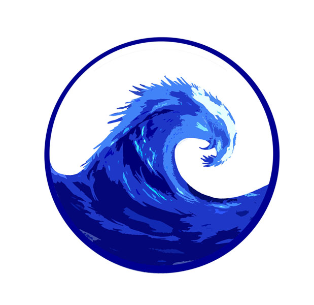

<!-- Improved compatibility of back to top link: See: https://github.com/othneildrew/Best-README-Template/pull/73 -->
<a name="readme-top"></a>
<!--
*** Thanks for checking out the Best-README-Template. If you have a suggestion
*** that would make this better, please fork the repo and create a pull request
*** or simply open an issue with the tag "enhancement".
*** Don't forget to give the project a star!
*** Thanks again! Now go create something AMAZING! :D
-->


<!-- PROJECT SHIELDS -->
<!--
*** I'm using markdown "reference style" links for readability.
*** Reference links are enclosed in brackets [ ] instead of parentheses ( ).
*** See the bottom of this document for the declaration of the reference variables
*** for contributors-url, forks-url, etc. This is an optional, concise syntax you may use.
*** https://www.markdownguide.org/basic-syntax/#reference-style-links
-->
[![Forks][forks-shield]][forks-url]
[![Stargazers][stars-shield]][stars-url]
[![Issues][issues-shield]][issues-url]
[![MIT License][license-shield]][license-url]
[![LinkedIn][linkedin-shield]][linkedin-url]


<!-- PROJECT LOGO -->
<br />
<div align="center">
  <a href="https://github.com/jeremykenneth7/Tsunami-Warning-Center">
    
  </a>

<h3 align="center">Tsunami Warning Center</h3>

  <p align="center">
    App for Tsunami Disaster and Warning Center with API on Realtime Earthquake data +5.0 Magnitudo and Realtime Maps with GeoJSON prevention Tsunami Warning in Indonesia
    <br />
    <a href="https://github.com/jeremykenneth7/Tsunami-Warning-Center"><strong>Explore the docs »</strong></a>
    <br />
    <br />
    <a href="https://github.com/jeremykenneth7/Tsunami-Warning-Center">View Demo</a>
    ·
    <a href="https://github.com/jeremykenneth7/Tsunami-Warning-Center/issues">Report Bug</a>
    ·
    <a href="https://github.com/jeremykenneth7/Tsunami-Warning-Center/issues">Request Feature</a>
  </p>
</div>


<!-- TABLE OF CONTENTS -->
<details>
  <summary>Table of Contents</summary>
  <ol>
    <li>
      <a href="#about-the-project">About The Project</a>
      <ul>
        <li><a href="#built-with">Built With</a></li>
      </ul>
    </li>
    <li>
      <a href="#getting-started">Getting Started</a>
      <ul>
        <li><a href="#installation">Installation</a></li>
      </ul>
    </li>
    <li><a href="#contributing">Contributing</a></li>
    <li><a href="#license">License</a></li>
    <li><a href="#contact">Contact</a></li>
  </ol>
</details>


<!-- ABOUT THE PROJECT -->
## About The Project

[![Tsunami Warning Center][product-screenshot]](https://github.com/jeremykenneth7/Tsunami-Warning-Center)

App for Tsunami Disaster and Warning Center with API on Realtime Earthquake data +5.0 Magnitudo and Realtime Maps with GeoJSON prevention Tsunami Warning in Indonesia

<p align="right">(<a href="#readme-top">back to top</a>)</p>


### Built With

* [![PHP][PHP.com]][PHP-url]
* [![Bootstrap][Bootstrap.com]][Bootstrap-url]
* [![GeoJSON][GeoJSON.com]][GeoJSON-url]


<p align="right">(<a href="#readme-top">back to top</a>)</p>


<!-- GETTING STARTED -->
## Getting Started

To get a local copy up and running follow these simple example steps.

### Installation


1. Clone the repo
   ```sh
   git clone https://github.com/jeremykenneth7/Tsunami-Warning-Center.git
   ```
2. Put the file into xampp/htdocs

3. Turn On Apache and SQL on XAMPP


<p align="right">(<a href="#readme-top">back to top</a>)</p>


<!-- USAGE EXAMPLES -->
## Usage

To edit the frontend file upload the SQL data file into the database of phpmyadmin so the MAPS API can be turned

_For more examples, please refer to the [Documentation](https://github.com/jeremykenneth7/Tsunami-Warning-Center.git)_

<p align="right">(<a href="#readme-top">back to top</a>)</p>


<!-- CONTRIBUTING -->
## Contributing

Contributions are what make the open source community such an amazing place to learn, inspire, and create. Any contributions you make are **greatly appreciated**.

If you have a suggestion that would make this better, please fork the repo and create a pull request. You can also simply open an issue with the tag "enhancement".
Don't forget to give the project a star! Thanks again!

1. Fork the Project
2. Create your Feature Branch (`git checkout -b feature/TsunamiWarningCenter`)
3. Commit your Changes (`git commit -m 'Add some TsunamiWarningCenter'`)
4. Push to the Branch (`git push origin feature/TsunamiWarningCenter`)
5. Open a Pull Request

<p align="right">(<a href="#readme-top">back to top</a>)</p>


<!-- LICENSE -->
## License

Distributed under the MIT License. See `LICENSE.txt` for more information.

<p align="right">(<a href="#readme-top">back to top</a>)</p>


<!-- CONTACT -->
## Contact

Jeremy Kenneth - jeremykenneth7@gmail.com

Project Link: [https://github.com/jeremykenneth7/Tsunami-Warning-Center](https://github.com/jeremykenneth7/Tsunami-Warning-Center)

<p align="right">(<a href="#readme-top">back to top</a>)</p>


<!-- MARKDOWN LINKS & IMAGES -->
<!-- https://www.markdownguide.org/basic-syntax/#reference-style-links -->

[forks-shield]: https://img.shields.io/github/forks/jeremykenneth7/Tsunami-Warning-Center.svg?style=for-the-badge
[forks-url]: https://github.com/jeremykenneth7/Tsunami-Warning-Center/network/members
[stars-shield]: https://img.shields.io/github/stars/jeremykenneth7/Tsunami-Warning-Center.svg?style=for-the-badge
[stars-url]: https://github.com/jeremykenneth7/Tsunami-Warning-Center/stargazers
[issues-shield]: https://img.shields.io/github/issues/jeremykenneth7/Tsunami-Warning-Center.svg?style=for-the-badge
[issues-url]: https://github.com/jeremykenneth7/Tsunami-Warning-Center/issues
[license-shield]: https://img.shields.io/github/license/jeremykenneth7/Tsunami-Warning-Center.svg?style=for-the-badge
[license-url]: https://github.com/jeremykenneth7/Tsunami-Warning-Center/blob/master/LICENSE.txt
[linkedin-shield]: https://img.shields.io/badge/-LinkedIn-black.svg?style=for-the-badge&logo=linkedin&colorB=555
[linkedin-url]: https://www.linkedin.com/in/jeremy-kenneth-24b06b233/
[product-screenshot]: images/gempa.png

[PHP.com]: https://img.shields.io/badge/PHP-563D7C?style=for-the-badge&logo=PHP&logoColor=white
[PHP-url]: https://www.php.net/
[Bootstrap.com]: https://img.shields.io/badge/Bootstrap-563D7C?style=for-the-badge&logo=bootstrap&logoColor=white
[Bootstrap-url]: https://getbootstrap.com
[GeoJSON.com]: https://img.shields.io/badge/GeoJSON-0769AD?style=for-the-badge&logo=GeoJSON&logoColor=white
[GeoJSON-url]: https://geojson.org/ 
